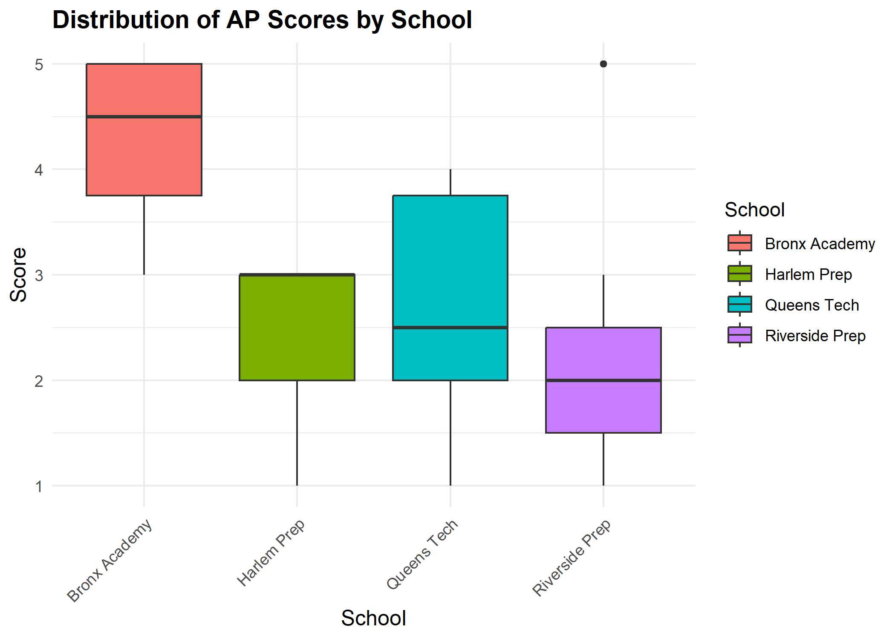
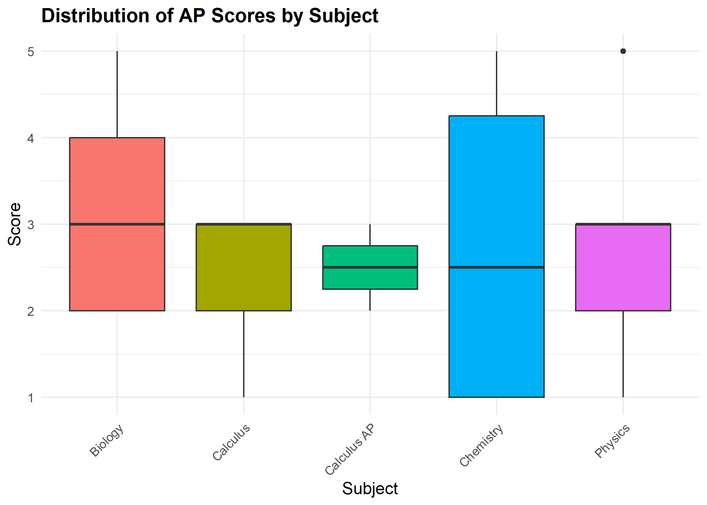

# 📘 R Project: AP Data Preparation & Analysis

## 📘 Overview  
This project focuses on the initial data preparation, cleaning, and exploratory analysis of raw Advanced Placement (AP) student performance data using the **R programming language** (specifically the **Tidyverse** library). It demonstrates the ability to transform complex, messy source files into a structured, normalized dataset, suitable for high-level BI reporting.The goal was to build a reusable, reproducible **ETL process** outside of a dedicated BI tool.
  
  
*Key Highlights:*
- **Advanced Data Cleaning:** Used **R functions** to handle inconsistenies, standardize date formats, and correct missing values across multiple data sources.
- **Exploratory Data Analysis (EDA):** Performed initial analysis to identify student performance trends, outliers, and data quality issues.
- **Star Schema-ready format** (Fact and Dimension tables) for efficient loading into a data warehouse or **Power BI**.
- **REproducible Pipeline:** Created a scripted, documented process that can be easily updated and run on future datasets.

---

## 💻 Tools & Technologies  

- **R:** Primary language for data cleaning and transformation.
- **Tidyverse:** Utilized key packages **'dplyr'* for data manipulation and **'readr'** for efficient CSV handling.
- **SQL (Conceptual/Planned):** Data normalization process was designed to output a structured dataset suitable for loading into a relational database (e.g., PostgreSQL or SQL Server).
- **Markdown:** Used for professional documentation of the project.

---

## 🖼️ Preview  
This project showcases the *output* of the R data pipeline.  

**Output Files:** A clean, normalized 'students_fact.csv' file and 'schools_dim.csv' file, ready for any BI tool or data warehouse.  

**Key Visuals:**

*   
*   
*   

---

## 📁 Files
This repository contains the following key project asstes:  

* **Source Code:** [Link to R Script](AP_Data_Preparation.R)
  (The complete R script used for ETL and EDA.)
* **Processed Data Output:** [Link to Processed CSV](AP_Dataset_Public.csv)
  (The normalized, clean data ready for BI analysis.)

---

## 🚀 Insights
This project demonstrates several key data preparation and analytical skills:

* **Robust ETL Pipeline:** Successfully handled and corrected data type 
    inconsistencies and null values across a large-scale, disparate 
    dataset, ensuring downstream analysis relies on quality inputs.
* **EDA Proficiency:** Used `ggplot2` to quickly identify trends in 
    Advanced Placement subject scores and participation rates, providing 
    an immediate analytical layer to the raw data.
* **Data Modeling Readiness:** The output (normalized CSV files) shows 
    an understanding of dimensional modeling, specifically creating Fact 
    and Dimension tables for optimized BI tool performance.

---

## 🧠 Next Steps
Future iterations of this project could include:

* **SQL Integration:** Loading the clean CSV files into a PostgreSQL 
    or SQLite database and performing the final join/view creation using 
    SQL for enhanced query performance.
* **Automation:** Containerizing the R script using Docker to create 
    a scheduled, repeatable data ingestion workflow.
* **Time Series Analysis:** Extending the EDA to include time series 
    forecasting on participation and score trends using R's forecasting 
    libraries.

---

## 📬 Contact
**Created by:** Neka Everett

🔗 [Portfolio Home](https://github.com/nekaeve24/data-portfolio)
